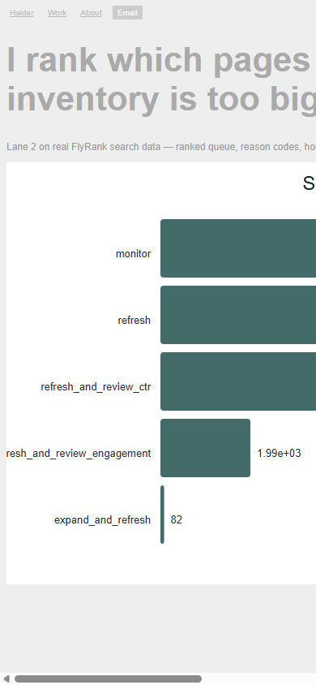
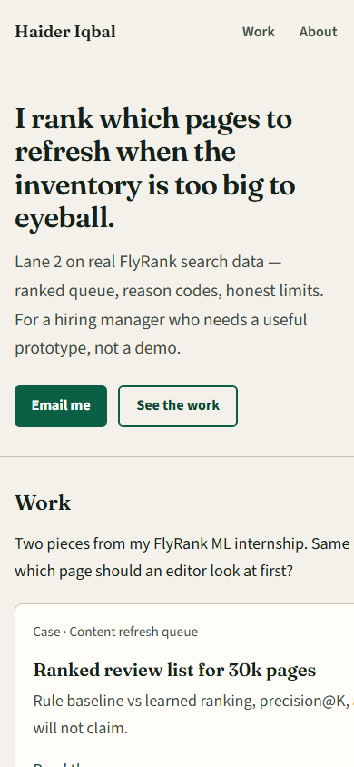

# Week 7 fix log — Open it on your phone

**Live URL:** https://haideriqbal499.github.io/Flyrank_Ml_internship/

**Proof statement:** I build ranking systems on messy search data and say what they can and cannot claim. Audience: a hiring manager who needs a useful prototype. One action: email me about an ML intern / junior role.

Screenshots (phone width 390px):

| Before (broken draft) | After (fixed) |
|---|---|
|  |  |

Frozen before artifact: [`_before-mobile.html`](_before-mobile.html) (not linked from the site nav).

---

## What was broken → what changed

| # | Broken | Fix |
|---|---|---|
| 1 | No `viewport` meta — phone zoomed a 1100px layout | Added `<meta name="viewport" content="width=device-width, initial-scale=1">` on every page |
| 2 | Fixed `.wrap { width: 1100px }` — horizontal scroll on phone | Fluid `width: min(100% - 2rem, 58rem)` |
| 3 | Headline ~42px gray on gray — hard to read, clipped | `clamp()` type, ink on paper, contrast-checked accent `#0b5f45` on cream |
| 4 | Nav / Email links ~10px padding — untappable | Min tap height 44px; on ≤480px Email button goes full-width on its own row |
| 5 | Work chart forced to 960px wide — spilled off-screen | `img { max-width: 100% }` + scroll wrapper on figures; SVG stays crisp (no blurry bitmap upscale) |
| 6 | Low-contrast gray buttons (`#ccc` on `#eee`) | Solid green primary CTA, outlined ghost secondary; focus rings for keyboard |
| 7 | No clear one-action path | Sticky header + hero **Email me** mailto + Contact page |
| 8 | Demo/repo risk | Every case links to the real GitHub repo / notebooks; mailto uses `haideriqbal499@gmail.com` |

## Checks run

- Phone 390×844, tablet 768, desktop 1280 — screenshots in `docs/img/after-*.png`
- Links clicked: Home, Work cards, both case pages, About, Contact, mailto, GitHub repo, notebook blob URLs
- Images: SVG charts only (small files, sharp at any width)
- Accessibility: skip link, focus styles, semantic headings, alt text on charts

## AI audit summary (home + case)

- **Mobile:** first draft spilled; fixed with fluid layout + tap targets.
- **Accessibility:** contrast and focus were the main gaps; fixed with darker ink, green CTAs, `:focus-visible`.
- **Speed:** no oversized photos; two SVGs + two font families with `display=swap`.

## Week 7 nice-to-haves (landed)

Chart thumbnail on the home work card, one-click Colab on the refresh-queue case, deeper About without internship “Lane 2” jargon.
